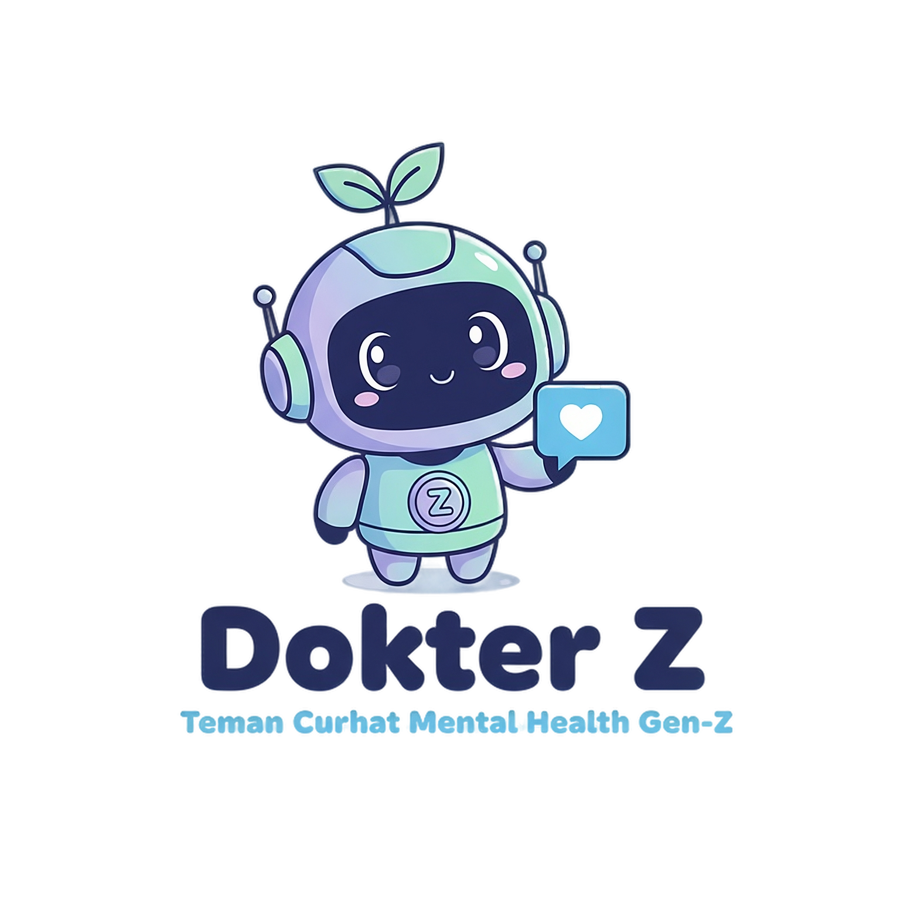
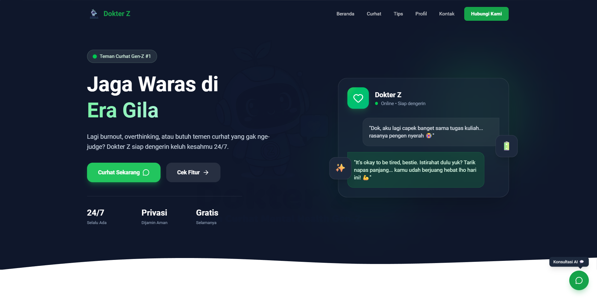
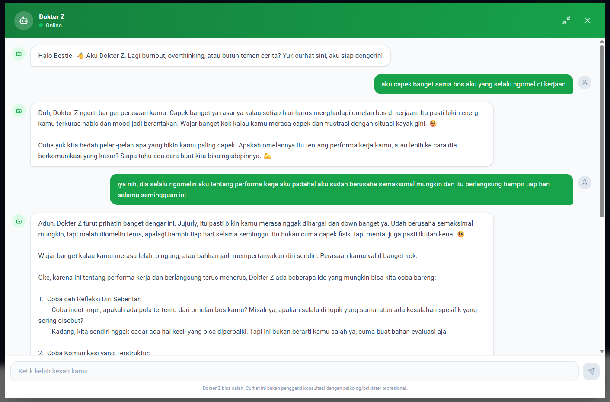
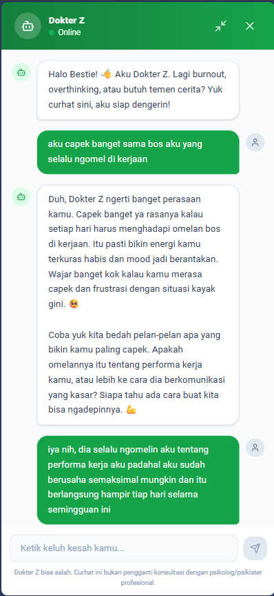

# Dokter Z - AI Mental Health Companion for Gen-Z 🧠✨



[**🌐 LIVE DEMO**](https://dokterz.ahdx.dev)

**Dokter Z** adalah teman curhat virtual berbasis AI yang dirancang khusus untuk Generasi Z. Dibalut dengan persona yang santai, empatik, dan "ngerti banget" bahasa anak muda, Dokter Z hadir untuk menemani di saat *burnout*, *overthinking*, atau sekadar butuh teman ngobrol tanpa takut di-*judge*.

Proyek ini dibangun sebagai bagian dari tugas akhir **Hacktiv8 "Maju Bareng AI" - AI Productivity and AI API Integration for Developers**.

## 📸 Showcase

### Landing Page Modern


### ChatBot Experience
| Desktop View | Mobile View |
| :---: | :---: |
|  |  |

## 🚀 Fitur Utama

-   **Persona "Bestie" Gen-Z**: Gaya bahasa santai (slang), tidak kaku, namun tetap memberikan validasi emosi yang tulus.
-   **Konseling Empatik**: Menggunakan Google Gemini AI untuk memberikan respon yang menenangkan dan saran praktis.
-   **Chat Realistis**: Dilengkapi indikator "Sedang mengetik..." dengan jeda waktu alami agar terasa seperti mengobrol dengan manusia.
-   **Mode Layar Penuh (Maximize)**: Fokus curhat tanpa gangguan dengan mode *chat* layar penuh.
-   **Privasi Terjaga**: Chat bersifat anonim dan tidak menyimpan data sensitif jangka panjang (stateless session di frontend).
-   **Responsif**: Tampilan *mobile-friendly* yang kece di HP maupun Laptop.

## 🛠️ Teknologi

**Frontend:**
-   [React](https://react.dev/) + [Vite](https://vitejs.dev/)
-   [Tailwind CSS](https://tailwindcss.com/)
-   [Lucide React](https://lucide.dev/) (Icons)

**Backend:**
-   [Express.js](https://expressjs.com/) (Serverless Ready)
-   [Google Gemini API](https://ai.google.dev/) (`gemini-2.5-flash`)

**Deployment:**
-   [Vercel](https://vercel.com/) (Frontend & Backend Monorepo)

## 📦 Instalasi & Menjalankan Lokal

Ikuti langkah ini untuk menjalankan Dokter Z di komputermu:

### 1. Clone Repository
```bash
git clone https://github.com/wahdalo/dokter-gen-z.git
cd dokter-gen-z
```

### 2. Setup Backend & Install Dependencies
```bash
# Install root dependencies (Express, Gemini SDK)
npm install

# Buat file .env di root folder
cp .env.example .env
# Isi GEMINI_API_KEY=API_KEY_KAMU_DISINI
```

### 3. Setup Frontend
```bash
cd frontend
npm install
cd ..
```

### 4. Jalankan Aplikasi
Kamu bisa menjalankan Frontend dan Backend secara terpisah.

**Terminal 1 (Backend):**
```bash
npm run server
# Server berjalan di http://localhost:3000
```

**Terminal 2 (Frontend):**
```bash
cd frontend
npm run dev
# Frontend berjalan di http://localhost:5173
```

Buka `http://localhost:5173` di browser, dan Dokter Z siap menemani!

## 🌐 Deployment (Vercel)

Proyek ini sudah dikonfigurasi untuk deployment mudah ke Vercel:

1.  Silahkan fork repository ini.
2.  Lalu import project di Vercel.
3.  Set **Root Directory** ke `./` (default).
4.  Set **Output Directory** ke `frontend/dist`.
5.  Tambahkan Environment Variable `GEMINI_API_KEY`.
6.  Deploy! Script `vercel.json` dan `package.json` akan otomatis mengatur build dan routing.

## 🏆 Challenge Info

-   **Event**: Hacktiv8 - Maju Bareng AI
-   **Developer**: [wahdalo](https://github.com/wahdalo)

---
*Disclaimer: Dokter Z adalah AI dan bisa membuat kesalahan. Aplikasi ini bukan pengganti konsultasi medis atau psikologis profesional. Jika kamu atau temanmu dalam bahaya, segera hubungi profesional atau layanan darurat.*
